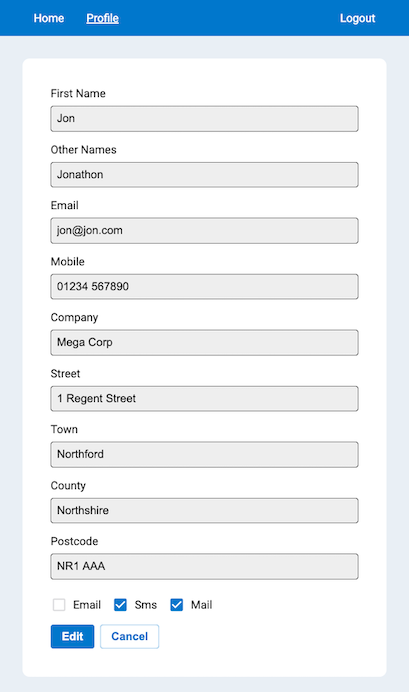

# Profile Settings App

## Running Locally

`yarn && yarn start`

## Login

Use the email `jon@jon.com` with any password

## Notes

- uses TypeScript
- uses `react-router` for page routing
- uses `Rebass` as a UI kit to speed up development. However normally I'd do manual styling
- uses `styled-components` for more powerful CSS selectors where required
- use of React hooks primarily `useState` and `useEffect`
- considered `useContext` and `useReducer` to allow state and dispatch tunneling but overkill given the simplicity of the app
- structure mimics a more complex app structure for demonstration

## Points of Interest

`/app/types.d.ts` is the TypeScript global declaration file
`/app/ui/App.tsx` guards the logged in/out rendering
`/app/ui/login/Login.tsx` is the login form
`/app/ui/nav/Nav.tsx` is the navigation menu
`/app/ui/profile/ProfileForm.tsx` is the Profile form entry point
`/app/ui/profile/on-change-create-profile.ts` is a helper that creates a new Profile given a form input event

## Improvements

- more testing of UI components
- use library for form rendering
- minor refactor i.e. constants, break out larger components
